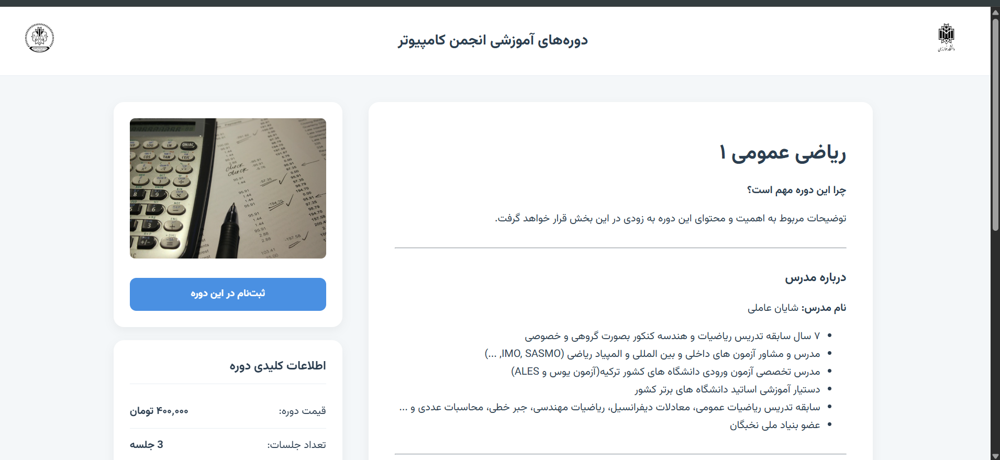
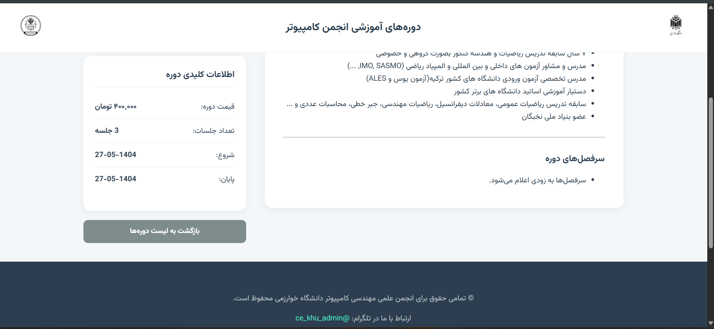
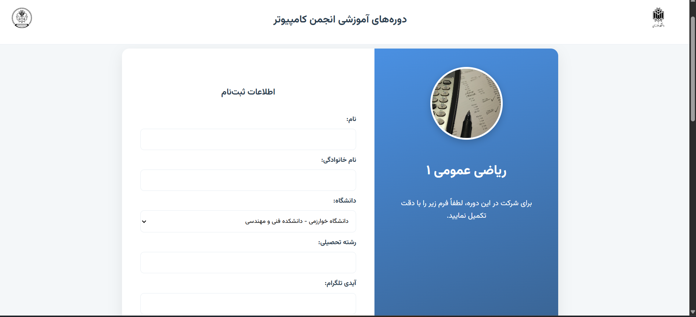

# 📚 Kharazmi University Computer Association – Course Management Website

This is the **official website** for the **Kharazmi University Computer Association**, designed to manage and display university courses, allow students to register online, and provide detailed course and instructor information.  
The platform is built with **Django** and is currently live at:

🌐 **[Visit the Live Website](https://khucomputerassociation.pythonanywhere.com/)**

---

## ✨ Features

- **Homepage** with dynamic list of courses from JSON data
- **Course details** page with instructor information and schedule
- **Online registration** form for each course
- **Receipt upload** functionality for payment verification
- **Custom 404 page** for invalid course links
- **Separation of static files** (CSS/JS) and JSON-based course data
- **No database dependency for course details** – all stored in JSON files

---

## 🖼 Screenshots

### 1. Homepage


### 2. Course Details Page




### 3. Registration Form


---

## 🗂 Project Structure

```plaintext
associationCoursePage/
├── manage.py
├── apps/
│   ├── course/         # Handles course detail view
│   ├── index/          # Homepage and course listing
│   └── signCourse/     # Course signup and form handling
├── associationCoursePage/
│   ├── settings.py     # Django settings (loads secret key from file)
│   ├── urls.py         # Main URL routing
│   └── wsgi.py
├── files/
│   └── information/    # JSON files for courses, sessions, teachers
├── scripts/
│   ├── css/            # Stylesheets
│   └── js/             # JavaScript scripts
└── templates/          # HTML templates
```

## installation & setup

### 1.clone the repo.
clone the repo and navigate to main part of project.

```bash
git clone https://github.com/yasharzavary/associationCourse.git
cd associationCourse/associationCoursePage
```

### 2.create & activate env.
for creating env, run this

```bash
python -m venv venv

```
**⚠warning**: if you use python version 11 or earlier, this code can give you error...in this case,
you should use python3 instead of python. if this don't solve your problem, search or ask chat AIs for specific codes.

after creating env, activate it.
```bash
source venv/bin/activate   # Linux/Mac

venv\Scripts\activate      # Windows
```

### 3.install requirements.
after activation, run
```bash
pip install -r requirements.txt
```

### 4. create secret_key.
for django project, you should create your own secret key,
for this first create **secret_key.txt** file in this directory(you can use your editor or *touch* code in terminal.)

**NOTE**: for creating secret_key, you can use this code:
```bash
python -c "from django.core.management.utils import get_random_secret_key; print(get_random_secret_key())"
```

or you can create python file and run this code:
```python
from django.core.management.utils import get_random_secret_key
print(get_random_secret_key())
```

### 5. run server
run one line code in terminal(or cmd in windows)
```bash
python manage.py runserver

```

## 📄 JSON Data Structure
- courses.json –> Basic info about each course
- teacher_resumes.json –> Instructor biography & details
- session_details.json –> Session schedule information

### example json file
```json
{
  "id": 1,
  "title": "نظریه زبان ها و ماشین ها",
  "instructor": "یاشار زواری رضائی",
  "start_date": "2025-01-01",
  "end_date": "2026-01-01",
  "course_picture": "machine_theory.png",
  "teacher": "yashar.png"
}
```

## 🛠 technoloty stack
- Backend: Django (Python)
- Frontend: HTML, CSS, JavaScript
- Data Storage: JSON files (no SQL database for course content)
- Hosting: PythonAnywhere


## 🤝 Contributing
We welcome contributions!
If you’d like to improve the site, fix bugs, or add new features:

1. Fork the repo
2. Create a new branch (feature/awesome-feature)
3. Commit your changes
4. Submit a pull request

## 📜 License
This project is licensed under the MIT License – see the [LICENSE](https://opensource.org/license/mit) file for details.


